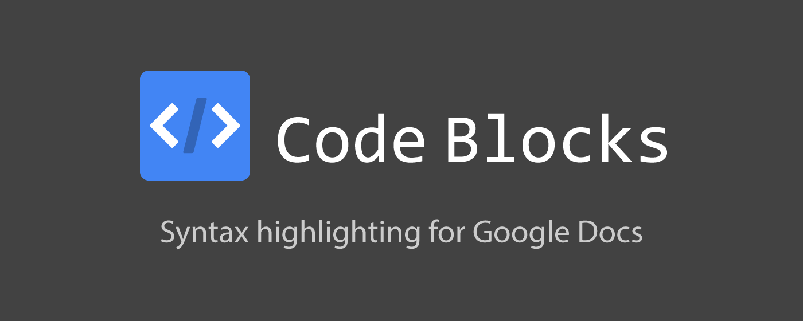
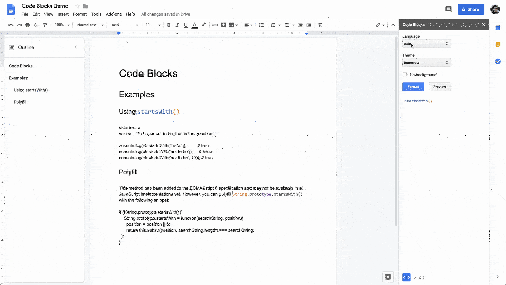
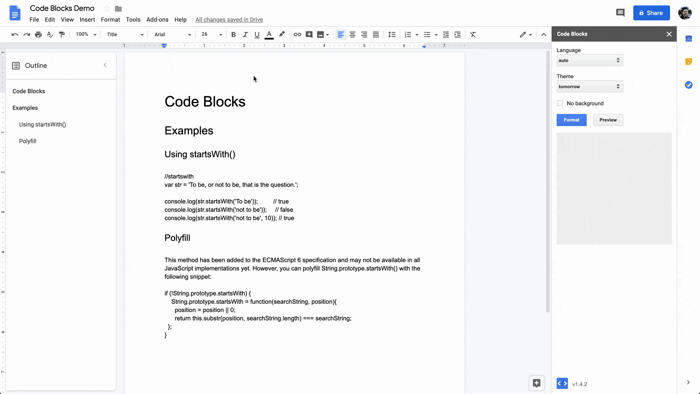
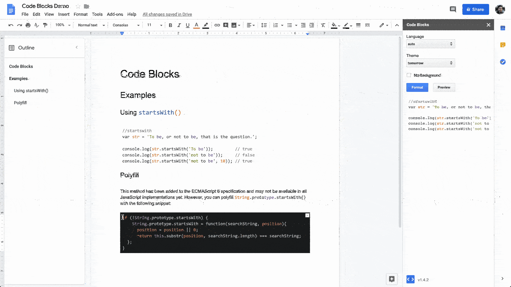

---
title:
layout: home
permalink: /
---

 

## Usage

### Starting the add-on

### Formatting inline code

### Formatting code blocks

### Reformatting code blocks

### Previewing themes

Examples of the different color themes applied to various languages can be
found on the [highlight.js demo page](https://highlightjs.org/static/demo/).

### Unformatting code

To clear formatting in Docs, highlight the text and select
`Format > Clear Formatting` from the toolbar. The keyboard shortcut is
<kbd>Cmd</kbd>+<kbd>/</kbd> on OS X and <kbd>Ctrl</kbd>+<kbd>/</kbd> on Windows:
<https://support.google.com/docs/answer/179738>

This will not remove the table that the text lives in if it's a "code block".
To do that, you'll have to copy the text and paste it outside the table, then
right-click the table and select **Delete table**.

## Limitations

### Updates to syntax highlighting

Code Blocks is built with [highlight.js](https://highlightjs.org/) and can only
provide syntax highlighting for languages that are supported by that library.

If you'd like to see Code Blocks support a language that is not yet implemented
by highlight.js, please refer to [their page on requesting new languages](http://highlightjs.readthedocs.io/en/latest/language-requests.html).

If you'd like to see Code Blocks update or fix support for an existing language:
1. Check if the [latest version of highlight.js](https://github.com/highlightjs/highlight.js/releases)
already includes the update. If it does, submit a PR to this repository that
bumps the highlight.js version in [`package.json`](https://github.com/alexwforsythe/code-blocks/blob/master/package.json).
2. If highlight.js does not yet include the update, please submit an issue on
[their issue tracker](https://github.com/highlightjs/highlight.js/issues).

### Real-time syntax highlighting

Codes Blocks uses Google's
[Apps Script](https://developers.google.com/apps-script/), a server-side
JavaScript platform, to interact with Docs and format code. Each time the add-on
formats a snippet of code, a request is made to the Apps Script backend to
modify the current Doc. There are a few limitations of this platform that
prevent Code Blocks from formatting code as you type:
* The [`onEdit`](https://developers.google.com/apps-script/guides/triggers#onedite)
event that fires when a user modifies content is only available in Sheets
* [Time-driven triggers](https://developers.google.com/apps-script/guides/triggers/installable#time-driven_triggers)
can only be used once per hour at most
* Each request to modify the current Doc can take multiple seconds, so code
formatting cannot be performed in real-time
* The number of requests needed to update a Doc in near real-time may exceed
the service API quotas

### Keyboard Shortcuts

Keyboard shortcuts can only be handled by Code Blocks if the add-on sidebar is
focused, which would require users to click the sidebar anyway.

Keyboard events in the active document cannot currently be handled by Docs
add-ons: <https://issuetracker.google.com/issues/79461369>
