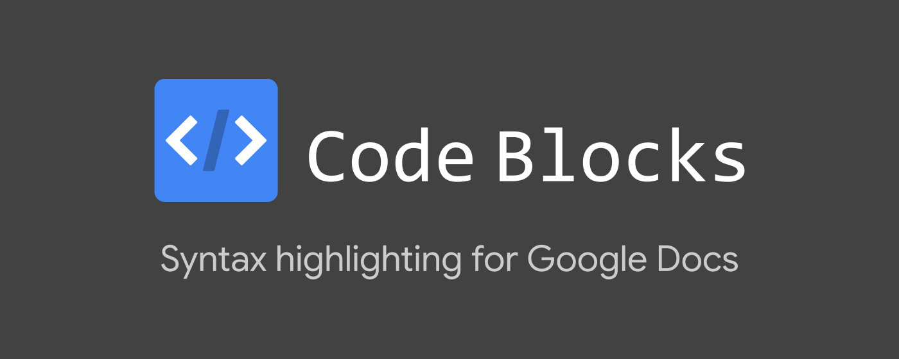
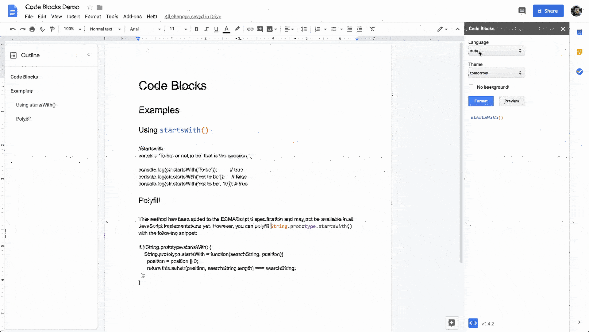
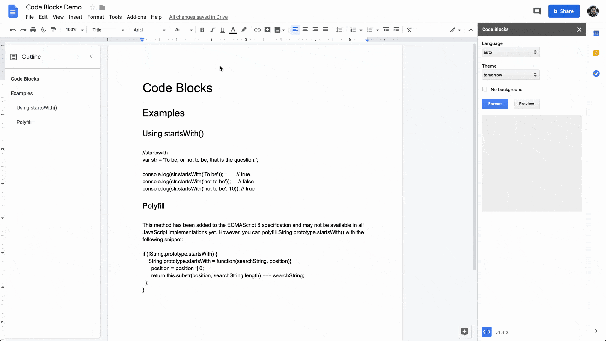
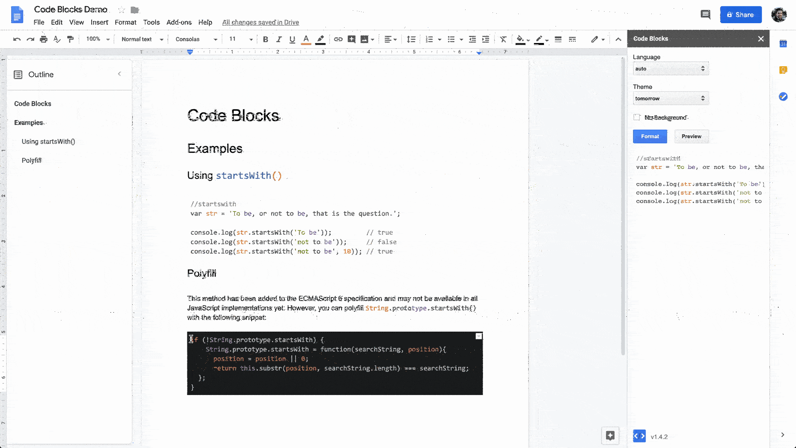

---
title:
layout: home
permalink: /
---



[](https://paypal.me/alexwforsythe)

<a href="https://workspace.google.com/marketplace/app/code_blocks/100740430168?pann=b" target="_blank" aria-label="Get it from the Google Workspace Marketplace">
  
</a>

## Usage

### Starting the add-on



### Formatting inline code



### Formatting code blocks


### Reformatting code blocks



### Previewing themes

Examples of the different color themes applied to various languages can be found
on the [highlight.js demo page](https://highlightjs.org/static/demo/).

### Unformatting code

To clear formatting in a doc, highlight the text and select
`Format > Clear Formatting` from the toolbar. The keyboard shortcut is
<kbd>Cmd</kbd>+<kbd>/</kbd> on OS X and <kbd>Ctrl</kbd>+<kbd>/</kbd> on Windows:
<https://support.google.com/docs/answer/179738>

This will not remove the table that the text lives in if it's a "code block". To
do that, you'll have to copy the text and paste it outside the table, then
right-click the table and select **Delete table**.

## Limitations

### Updates to syntax highlighting

Code Blocks is built with [highlight.js](https://highlightjs.org/) and can only
provide syntax highlighting for languages that are supported by that library.

If you'd like to see Code Blocks support a language that is not yet implemented
by highlight.js, please refer to
[their page on requesting new languages](http://highlightjs.readthedocs.io/en/latest/language-requests.html).

If you'd like to see Code Blocks update or fix support for an existing language:

1. Check if the
   [latest version of highlight.js](https://github.com/highlightjs/highlight.js/releases)
   already includes the update. If it does, submit a PR to this repository that
   bumps the highlight.js version in
   [`package.json`](https://github.com/alexwforsythe/code-blocks/blob/master/package.json).
2. If highlight.js does not yet include the update, please submit an issue on
   [their issue tracker](https://github.com/highlightjs/highlight.js/issues).

### Real-time syntax highlighting

Codes Blocks uses Google's
[Apps Script](https://developers.google.com/apps-script/)™, a server-side
JavaScript platform, to interact with Docs™ and format code. Each time the
add-on formats a snippet of code, a request is made to the apps script backend
to modify the current doc. There are a few limitations of this platform that
prevent Code Blocks from formatting code as you type:

- The
  [`onEdit`](https://developers.google.com/apps-script/guides/triggers#onedite)
  event that fires when a user modifies content is only available in Sheets™
- [Time-driven triggers](https://developers.google.com/apps-script/guides/triggers/installable#time-driven_triggers)
  can only be used once per hour at most
- Each request to modify the current doc can take multiple seconds, so code
  formatting cannot be performed in real-time
- The number of requests needed to update a doc in near real-time may exceed the
  service API quotas

### Keyboard Shortcuts

Keyboard shortcuts can only be handled by Code Blocks if the add-on sidebar is
focused, which would require users to click the sidebar anyway.

Keyboard events in the active document cannot currently be handled by Docs™
add-ons: <https://issuetracker.google.com/issues/79461369>

## Running a local copy

You can build the add-on from source and install it in your own Google
account for testing, without publishing it to the Marketplace. It runs as an
unpublished [Editor Add-on test deployment][test-editor-addon], visible only
to the account that owns the script.

[test-editor-addon]: https://developers.google.com/workspace/add-ons/how-tos/testing-editor-addons

### Prerequisites

- Node.js 22 (`.node-version`)
- A Google account, with the Apps Script API turned on at
  <https://script.google.com/home/usersettings>

### First-time setup

```sh
npm ci
npx clasp login                 # authorises clasp for your Google account

npm run build                   # generates dist/
npx clasp create --type standalone --title "Code Blocks (dev)"
```

`clasp create` writes a `.clasp.json` (git-ignored). Make sure it is in the
**repo root**, not in `dist/`, and that it points the push at `dist/`:

```json
{
  "scriptId": "<your script id>",
  "rootDir": "dist"
}
```

### Push the build

```sh
npm run push
```

`push` rebuilds `dist/` and runs `clasp push`. It stops on a prompt –
*"Manifest file has been updated. Do you want to push and overwrite?"* –
answer `y`. To skip the prompt, run `npx clasp push -f`.

### Install it as a test add-on

1. `npx clasp open` to open the project in the Apps Script editor.
2. **Deploy ▸ Test deployments**, choose **Editor Add-on** in the left list.
3. Scroll to the *Editor Add-on* section and click **Create a test**:
   - **Code**: `Latest Code`
   - **Test document**: pick an existing Doc, or create a new one
4. **Save**, then **Install** on the test row.
5. Open the test document. **Extensions ▸ Code Blocks (dev) ▸ Start** and
   approve the "unverified app" consent screen (it's your own script).

> **Sign in with one account only.** Apps Script cannot resolve add-on
> authorisation when several Google accounts are signed into the browser, and
> the add-on fails with `ScriptError: Exception: Action not allowed`. Use an
> Incognito window, or a browser profile, with just the account that owns the
> script. See [issue #167](https://github.com/alexwforsythe/code-blocks/issues/167).

### Iterate

```sh
npm test          # unit tests (node --test)
npm run push      # rebuild + upload; answer y to the manifest prompt
```

Test deployments always run *Latest Code*, so just reload the document after
a push.

### Where errors show up

- **Apps Script editor ▸ Executions** – server-side runs and `console.error`
  output.
- **Sidebar dev tools** – right-click inside the Code Blocks sidebar ▸
  *Inspect* ▸ *Console* for client-side errors.
